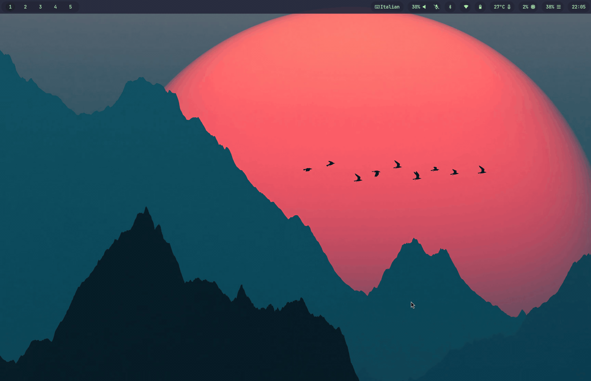

# yoyo 🪀


[](https://goreportcard.com/report/github.com/leolorenzato/yoyo)


**yoyo** is a **TUI command launcher** written in Go with [Bubble Tea](https://charm.land/bubbletea/v2).



### ✨ Features
- ⚙️ Configurable launch list
- 🔎 Search items in the list
- 🎨 Theme customization

### 🔧 Build from Source
- check Go version (requires **Go 1.24+**)
    ```bash
    go version
    ```

- build the app
    ```bash
    git clone git@github.com:leolorenzato/yoyo.git
    cd ./yoyo
    go build -o ./bin/yoyo ./cmd/app
    ```

### 🚀 Run
- create a config file (e.g `~/.config/yoyo/config.toml`)
- run the app
    ```bash
    ./bin/yoyo -c path/to/config.toml
    ```

### 🧩 Command Configuration

```toml
[app]
title = "User Panel 👤"
enableSearch = true

[[items]]
name = "whoami"
icon = "👤"
cmd = """$TERMINAL -e $SHELL -c 'whoami; exec $SHELL'"""

[[items]]
name = "system status"
icon = "📊"
cmd = """$TERMINAL -e $SHELL -c 'uptime; exec $SHELL'"""

[[items]]
name = "disk usage"
icon = "💽"
cmd = """$TERMINAL -e $SHELL -c 'df -h; exec $SHELL'"""

[[items]]
name = "network"
icon = "🌐"
cmd = """$TERMINAL -e $SHELL -c 'ip a; exec $SHELL'"""
```

### 🎨 Theme Configuration

```toml
[theme.container]
border = false
borderColor = "#6c6f85"
borderRounded = true

[theme.title]
border = false
borderColor = "#6c6f85"
borderRounded = true
textColor = "#f2cdcd"

[theme.search]
border = true
borderColor = "#6c6f85"
borderRounded = true
textColor = "#e0e0e0"

[theme.menu]
border = true
borderColor = "#6c6f85"
borderRounded = true
textColor = "#e0e0e0"
selectedItemTextColor = "#a6e3a1"

[theme.footer]
border = false
borderColor = "#6c6f85"
borderRounded = true
textColor = "#8f90a0"
```

## Hyprland

### Run
Launch the app (e.g., via a Hyprland keybind).  
❗️ The example below uses a terminal emulator that supports window classes.
```text
$TERMINAL --class yoyo-apps -e yoyo -c ~/.config/yoyo/apps.toml
```

To center the window and set a fixed size:
```text
windowrule = match:class ^(yoyo-apps)$, float on, center on, size 600 400
```

## 📄 License
Distributed under [MIT](https://github.com/leolorenzato/yoyo/blob/main/LICENSE)