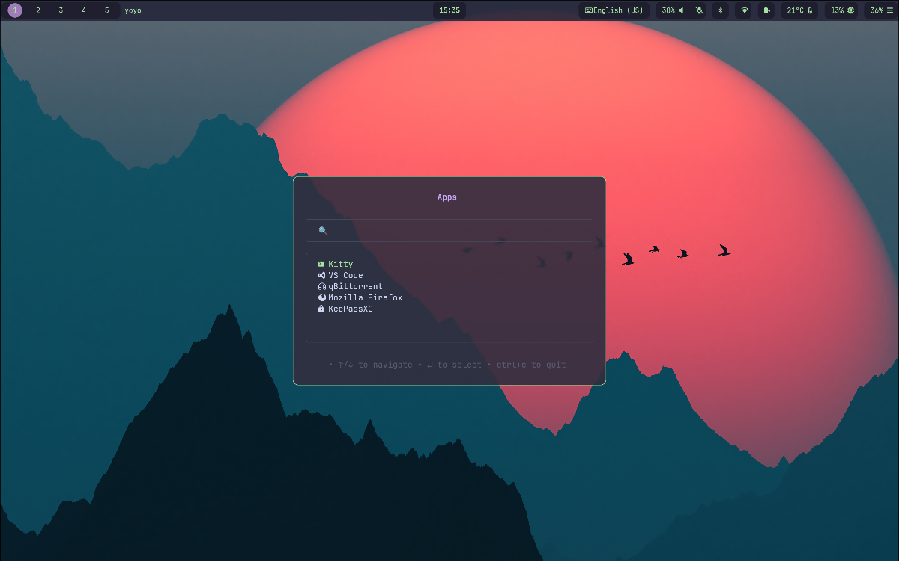

# yoyo 🪀


[](https://goreportcard.com/report/github.com/leolorenzato/yoyo)


**yoyo** is a lightweight **TUI command launcher** written in Go with [Bubble Tea](https://github.com/charmbracelet/bubbletea).



### ✨ Features
- ⚙️ Configurable launch list
- 🔎 Search items in the list
- 🎨 Theme customization
- 🚀 Fast & lightweight

### 🔧 Build from Source
- check Go version (requires **Go 1.24+**)
    ```bash
    go version
    ```

- build the app
    ```bash
    git clone git@github.com:leolorenzato/yoyo.git
    cd ./yoyo
    go build -o ./bin/yoyo ./cmd/app
    ```

### 🚀 Run
- create a config file (e.g `~/.config/yoyo/config.toml`)
- run the app
    ```bash
    ./bin/yoyo -c path/to/config.toml
    ```

### 🧩 Command Configuration

```toml
[app]
title = "Greetings 👋"
enableSearch = true

[[items]]
name = "hello"
icon = "🇬🇧"
cmd = """$TERMINAL -e $SHELL -c 'echo "Hello yoyo!🪀🚀"; exec $SHELL'"""

[[items]]
name = "ciao"
icon = "🇮🇹"
cmd = """$TERMINAL -e $SHELL -c 'echo "Ciao yoyo!🪀🚀"; exec $SHELL'"""

[[items]]
name = "hola"
icon = "🇪🇸"
cmd = """$TERMINAL -e $SHELL -c 'echo "Hola yoyo!🪀🚀"; exec $SHELL'"""
```

### 🎨 Theme Configuration

```toml
[theme.container]
border = false
borderColor = "#6C6F85"
borderRounded = true

[theme.title]
border = false
borderColor = "#6C6F85"
borderRounded = true
textColor = "#DDB6F2"

[theme.search]
border = true
borderColor = "#6C6F85"
borderRounded = true
textColor = "#E0E0E0"

[theme.menu]
border = true
borderColor = "#6C6F85"
borderRounded = true
textColor = "#E0E0E0"
selectedItemTextColor = "#A6E3A1"

[theme.footer]
border = false
borderColor = "#6C6F85"
borderRounded = true
textColor = "#8F90A0"
```

## 📄 License
Distributed under [MIT](https://github.com/leolorenzato/yoyo/blob/main/LICENSE)